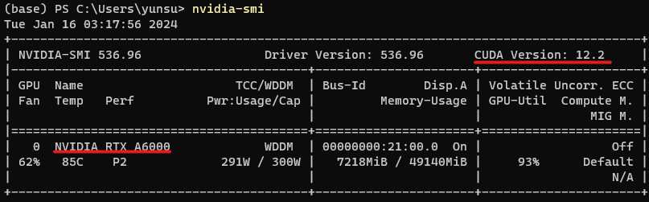

# 로컬에 GPU 사용 주피터 환경 설치법

Colab이 아닌 각자 노트북 혹은 데스크탑과 같은 로컬 환경에 GPU activated Jupyter 환경을 설치하는 방법입니다.

- 대상 운영체제 : Windows 10 or 11
- 대상 딥러닝 라이브러리 : `Tensorflow`

## 1. 사전 확인사항

- 우선, 본인의 컴퓨터에서 설치되어있는 외장 그래픽카드가 **Nvidia**사의 그래픽 카드여야 합니다.
- 이 외의 경우에도 가능은 하지만, 상당히 번거로울 수 있으므로, 추천하지 않습니다.
- Nvidia 그래픽카드를 사용하고 있다면, 다음 링크에서 그래픽 드라이버를 설치하여야 합니다. 일반적인 경우는 설치되어 있으니, 신경쓰지 않으셔도 됩니다.
    
    [최신 공식 NVIDIA 드라이버 다운로드](https://www.nvidia.co.kr/Download/index.aspx?lang=kr)
    
- 설치되었다면, `powershell` 을 실행시켜 다음 명령어를 사용하여 그래픽카드 종류 및 사용 가능한 최대 CUDA 버전을 확인합니다.

```bash
$ nvidia-smi
```



- 마지막으로 각 CUDA 버전에 알맞는 `Cudnn` 버전과 `Python` 버전을 정리해 놓은 다음 링크를 **반드시 참고**하여 아래 설치 가이드를 따라와 주세요.
- **GPU 섹션**을 참고해야합니다~

[소스에서 빌드  |  TensorFlow](https://www.tensorflow.org/install/source?hl=ko#linux)

## 2. Anaconda 설치

- Anaconda 설치는 쉽습니다. 다음 링크를 참고하여 최신 버전을 설치해주시면 됩니다.
- `Miniconda` 를 설치해도 상관없습니다.

**아나콘다 공식 링크**

[Free Download | Anaconda](https://www.anaconda.com/download)

**설치 방법 링크**

[아나콘다 설치 - Google Search](https://www.google.com/search?q=아나콘다+설치&oq=&gs_lcrp=EgZjaHJvbWUqCQgBEEUYOxjCAzIJCAAQRRg7GMIDMgkIARBFGDsYwgMyCQgCEEUYOxjCAzIJCAMQRRg7GMIDMgkIBBBFGDsYwgMyCQgFEEUYOxjCAzIJCAYQRRg7GMIDMgkIBxBFGDsYwgPSAQg3NTBqMGoxNagCCLACAQ&sourceid=chrome&ie=UTF-8)