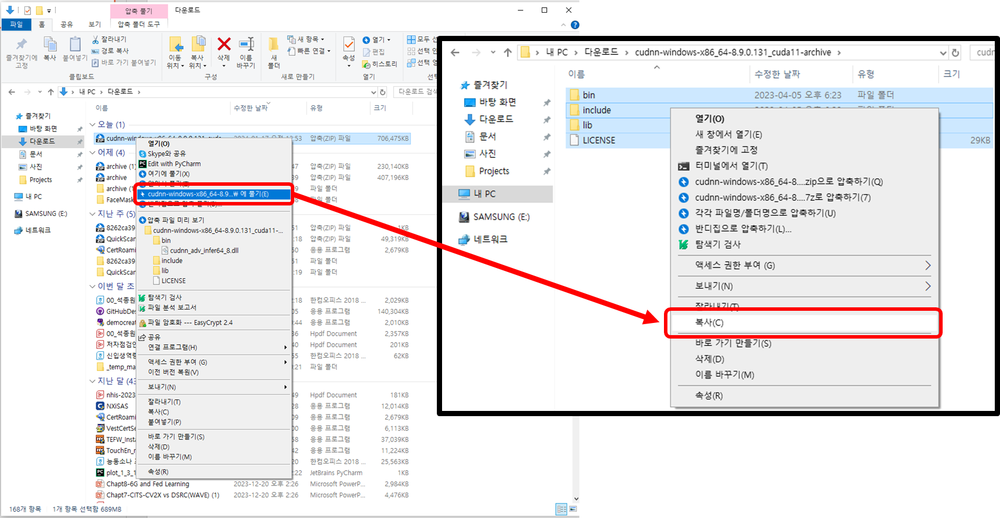
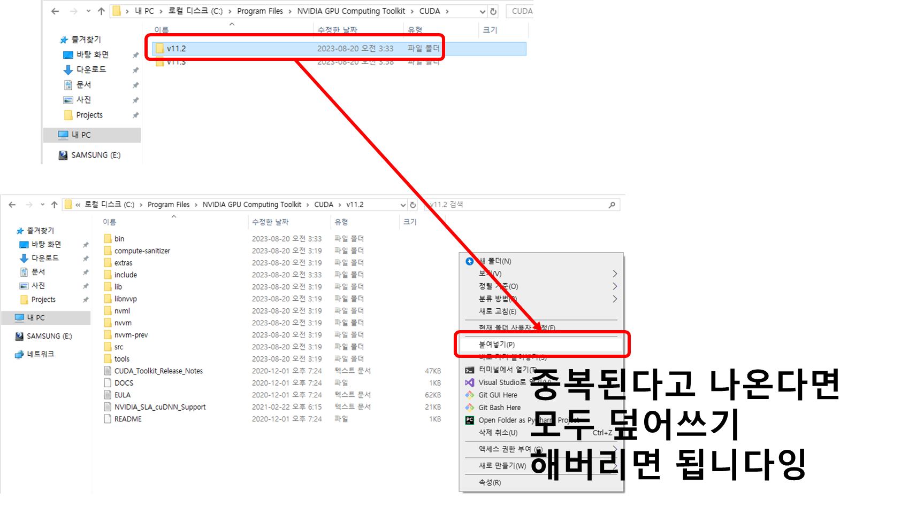

# 로컬에 GPU 사용 주피터 환경 설치법

Colab이 아닌 각자 노트북 혹은 데스크탑과 같은 로컬 환경에 GPU activated Jupyter 환경을 설치하는 방법입니다.

- 대상 운영체제 : Windows 10 or 11
- 대상 딥러닝 라이브러리 : `Tensorflow`

## 1. 사전 확인사항

---

- 우선, 본인의 컴퓨터에서 설치되어있는 외장 그래픽카드가 **Nvidia**사의 그래픽 카드여야 합니다.
- 이 외의 경우에도 가능은 하지만, 상당히 번거로울 수 있으므로, 추천하지 않습니다.
- Nvidia 그래픽카드를 사용하고 있다면, 다음 링크에서 그래픽 드라이버를 설치하여야 합니다. 일반적인 경우는 설치되어 있으니, 신경쓰지 않으셔도 됩니다.
    
    [최신 공식 NVIDIA 드라이버 다운로드](https://www.nvidia.co.kr/Download/index.aspx?lang=kr)
    
- 설치되었다면, `powershell` 을 실행시켜 다음 명령어를 사용하여 그래픽카드 종류 및 사용 가능한 최대 CUDA 버전을 확인합니다.

```bash
$ nvidia-smi
```


- 마지막으로 각 CUDA 버전에 알맞는 `Cudnn` 버전과 `Python` 버전을 정리해 놓은 다음 링크를 **반드시 참고**하여 아래 설치 가이드를 따라와 주세요.
- **GPU 섹션**을 참고해야합니다~

[소스에서 빌드  |  TensorFlow](https://www.tensorflow.org/install/source?hl=ko#linux)

## 2. Anaconda 설치

---

- Anaconda 설치는 쉽습니다. 다음 링크를 참고하여 최신 버전을 설치해주시면 됩니다.
- `Miniconda` 를 설치해도 상관없습니다.

**아나콘다 공식 링크**

[Free Download | Anaconda](https://www.anaconda.com/download)

**설치 방법 링크**

[아나콘다 설치 - Google Search](https://www.google.com/search?q=아나콘다+설치&oq=&gs_lcrp=EgZjaHJvbWUqCQgBEEUYOxjCAzIJCAAQRRg7GMIDMgkIARBFGDsYwgMyCQgCEEUYOxjCAzIJCAMQRRg7GMIDMgkIBBBFGDsYwgMyCQgFEEUYOxjCAzIJCAYQRRg7GMIDMgkIBxBFGDsYwgPSAQg3NTBqMGoxNagCCLACAQ&sourceid=chrome&ie=UTF-8)

### 2.1. 가상환경 만들기

- `Anaconda` 가 설치되었다면 Anaconda Prompt를 실행시켜 다음과 같은 명령어로 가상 환경을 생성해 줄 수 있습니다.

```bash
$ conda create -n "가상환경이름" python="파이썬버전"
```

- 생성된 가상환경을 활성화 시켜주는 명령어는 다음과 같습니다.

```bash
$ conda activate "가상환경이름"
```

- 활성화시켜주었다면 `IPython` 과 `Jupyter` 패키지를 설치해줍니다.

```bash
$ (가상환경명) PS C:\\작업경로) pip install ipython jupyter
```

- 다음 명령어로 `Jupyter Notebook` 을 실행시켜 주피터 노트북이 잘 실행되는지 확인해줍시다.

```bash
$ (가상환경명) PS C:\\작업경로) jupyter notebook
```

## 3. CUDA Toolkit 설치

---

- 대제목 1번에서 확인한 `Tensorflow` 와 `Python` 버전에 암자는 `CUDA` 툴킷을 설치해주도록 합니다.
- 다음 링크에서 알맞은 버전의 `CUDA` 툴킷을 설치해 주세요.
- 설치는 그냥 설치 파일의 가이드를 따라가면 됩니다.

[CUDA Toolkit Archive](https://developer.nvidia.com/cuda-toolkit-archive)

## 4. cuDNN 설치

---

- 마찬가지로 대제목 1번에서 확인한 `Tensorflow` , `Python`, `CUDA Toolkit` 버전에 알맞은 `cuDNN` 을 다운로드해 주세요
- NVIDIA 개발자 계정을 필요로 합니다. 없으시면 회원가입 해주세요. 돈 안듭니다.

[NVIDIA cuDNN Archive](https://developer.nvidia.com/rdp/cudnn-archive)

- 알맞은 버전의 cuDNN을 다운받았다면 압축을 풀고 다음과 같이 내부에 있던 파일들을 모두
- `CUDA Toolkit` 이 설치된 폴더에 옮겨주세요.
- 이후 다음 이미지들과 같은 과정을 진행하여 `cuDNN` 을 설치해 주세요.
    1. 다운받은 zip 파일을 압축 해제 해줍니다
    2. 압축 해제한 파일들을 복사 혹은 잘라내기하여 다음과 같은 경로에 붙여넣어주면 끝!
        - `C:\Program Files\NVIDIA GPU Computing Toolkit\CUDA\(각자 설치한 버전 넘버)`
    
    
    
    
    
    
    

## 5. 설치가 잘되었는지 확인

---

- GPU 연동이 잘 되었는지 확인을 위해 다음 `Python` 코드를 실행해주시면 됩니다.

```python
from tensorflow.config.experimental import list_physical_devices, list_logical_devices

print(list_physical_devices('GPU'))
print(list_logical_devices('GPU'))
```

- 아래와 같이 GPU가 적힌 결과가 출력된다면 성공!

```
[PhysicalDevice(name='/physical_device:GPU:0', device_type='GPU')]
[LogicalDevice(name='/device:GPU:0', device_type='GPU')]
```

